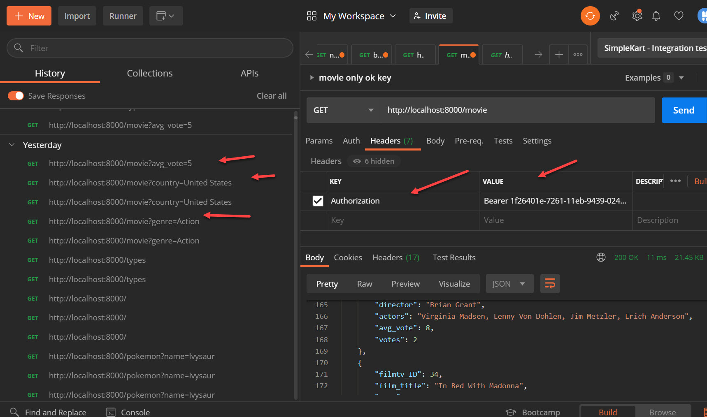

## >> App Name:

Movie-Search--Express-Server-drill

## >> APP Summary:

This project build an Express Server with secuired API enpoint so that it can be safely opened to the public. 

This APP allows user to query from a hught movies dataset and be able to filtered the serch by genre, country or average vote.

Note that endpoint only responds when given a valid Authorization header with a Bearer API token value. You can use the follow to geenate one  :

 [UUID generator](`https://www.uuidgenerator.net/version1)

Once it's gerneated, place the UUID sring inside a .env file with the following syntax.
API_TOKEN=YOUR-UUID

## >> Query String Parameters

- genre -  search for whether the Movie's genre includes a specified string. The search is case insensitive. (example genre=Action)
- country - search for whether the Movie's country includes a specified string.  The search should be case insensitive. (example country=United States)
- avg_vote -  search for Movies with an avereage vote(avg_vote) that is greater than or equal to the supplied number.

## >> Sample Endpoints

http://localhost:8000/movie

http://localhost:8000/movie?genre=Action

http://localhost:8000/movie?country=United States

http://localhost:8000/movie?avg_vote=5

## >> Screenshots

API query with Authorization header

React Fetch Client used for testing out the CORS middleware

## >> Technologies used in this APP:

* Express Server
* app.get API
* Express middleware
> API tokens
> Authorization headers
* doenv (for the .env API authehitic key file)
> CORS
> Helmet
* React client

-> Javascript: ES6

-> Tools
* Postman
* VSC Debugger
* nodemon 
* NPM
* morgan loggging tool

## >> [Github Link](https://github.com/davetam88/Movie-Search--Express-Server/)

